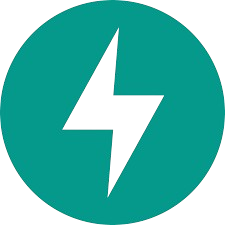

## Hi there 👋
I am EBIL PAUL - first of my name

- 🔭 I’m currently working with backend technologies
- 🌱  Acquired a Diploma in computer science at [Uganda Institute of Information and Communications Technology](https://uict.ac.ug/)
- 💬 Ask me about Backend development and Computer Vision
- 📫 How to reach me +256-760-852-958 email: ebilpaul06@gmail.com
- ⚡ Fun fact: An image is worth a thousand words

**`Computer Scientist (Backend Engineer / Cloud-Native Enthusiast)`**

I’m a computer scientist and backend engineer passionate about building reliable, scalable systems — with a strong interest in computer vision and its real-world applications. Though still learning, I actively build with tools like FastAPI (Python) and GoFiber (Go), and I enjoy solving problems with clean, backend-first architecture.

I’m deeply inspired by the open-source community and love working with cloud-native technologies like Docker and yet to explore Kubernetes to containerize, scale, and deploy backend services the right way.

Whether it's a university project or a personal initiative, I approach every build like a professional — designing, coding, breaking, and fixing until it works.

This GitHub is a reflection of my journey: learning in public, building with purpose, and always leveling up.

---

### 🧰 Languages and Tools

 
  
   
  
  
  
  
  
  
  
  
  
  

 
 

## 📓 Computer Vision Notebooks

Explore my collection of hands-on computer vision projects built with PyTorch, OpenCV, and modern deep learning tools.

📁 [View the Full Repository](https://github.com/paulebil/ComputerVisionNotebooks-Tut)

> These notebooks document my learning journey and are inspired by open tutorials and research papers.

#
### 📊 Stats

| GitHub Stats | Streak Stats |
|:------------:|:------------:|
|  |  |
 

#

 
<h3>👨‍💻 My Coding Journey</h3>

  I started my coding journey as a curious computer science student, fascinated by how real-world systems are built — not just the code, but the infrastructure, architecture, and tools behind them.

I naturally gravitated toward backend development, building APIs and architecting systems using tools like FastAPI and GoFiber. As I gained experience, I developed a strong interest in cloud-native technologies — not because I wanted to rely on cloud platforms, but because I wanted to learn how to host and manage my own applications locally or on-premises. That drive for independence and deep understanding continues to shape how I build.

Another major curiosity of mine is computer vision — the idea that machines can see, interpret, and interact with the world just like we do. To me, this is more than just technology; it’s personal. My parents always hoped I would become a doctor. While I may not wear a white coat, I’ve come to realize that with computer vision, I can still solve problems in medicine, healthcare, and diagnostics — with code. I will be a doctor — just using a different set of tools.

Even though I’m still a student of computer science, I approach every project with a builder’s mindset: learn deeply, solve real problems, and keep growing. This GitHub is where I share that journey — openly, and in motion.

And I’m just getting started.
